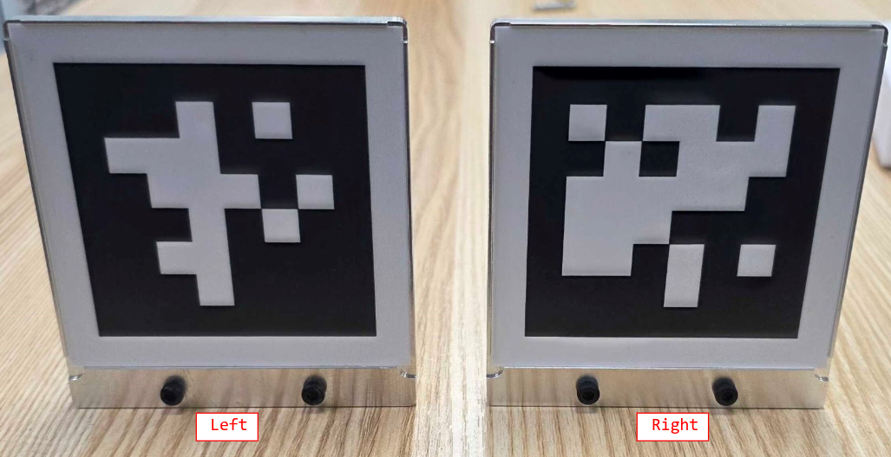
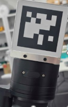
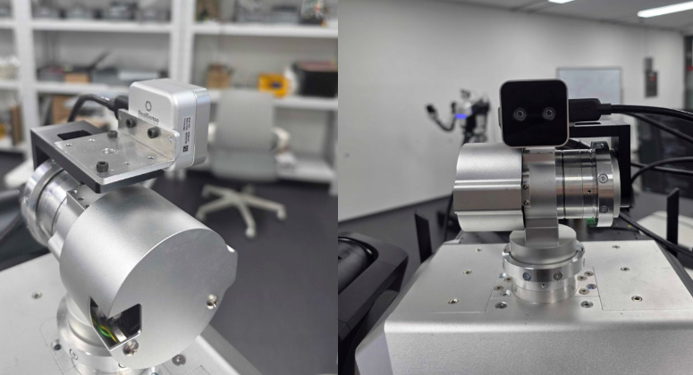
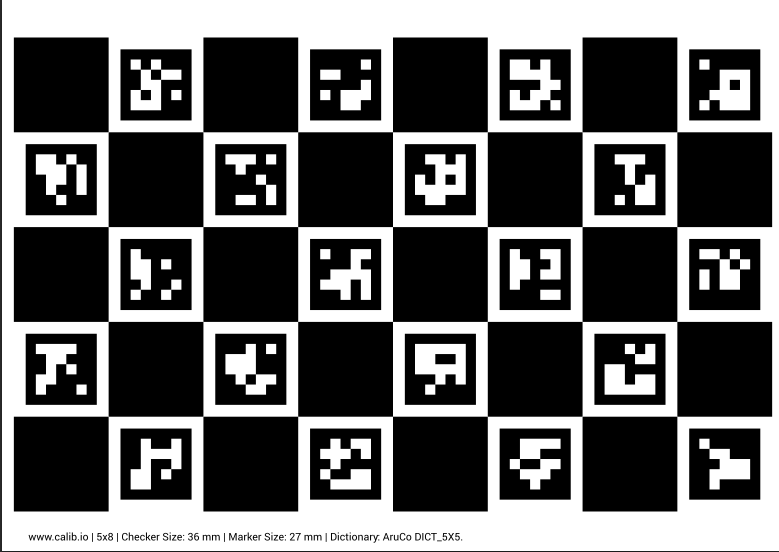
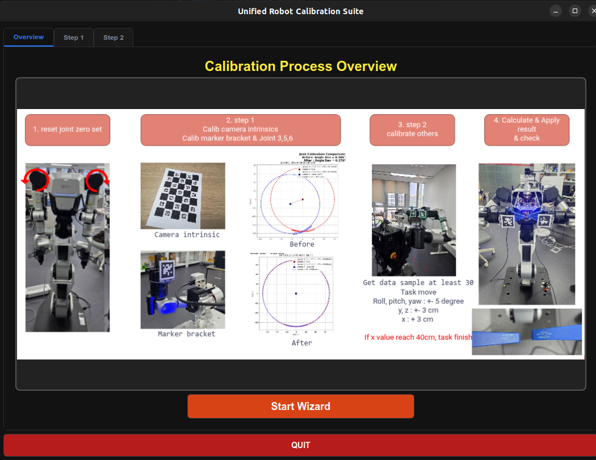

# Camera Calibration Manual
> [!CAUTION]
> ## This system can work only 1.2 version robot now.

## Overview
This is a camera calibration tool for the robot to calibrate joint offsets and camera extrinsics.
- **OS**: Ubuntu 22.04
- **SDK compatibility**: rby1-sdk 0.10.x and later
- **Python version**: 3.10
- **Camera**: Intel RealSense D405 (Resolution: 1280x720, 30 FPS)
- **Markers**: AprilTag (Plate Marker: Size 80mm. ID: Left (7), Right (8))

### Hardware Configuration

#### 1. Marker Installation
You must remove the currently attached gripper and connect the marker plates **directly to the tool flange**.
- **Left Arm**: AprilTag ID 7
- **Right Arm**: AprilTag ID 8

 
   

> **Note** if you need disassembly gripper, see [disassembly gripper](https://rainbowco-my.sharepoint.com/:p:/g/personal/support_rainbow-robotics_com/IQBQNoNxvENnSIt29V1aNsCCAYICOBKbsLJnAnvFFuTkA80?e=AEW1KM).


*(Please ensure the correct marker is attached to the corresponding arm.)*

#### 2. Camera Bracket
The Intel RealSense D405 camera must be securely mounted to the bracket facing directly forward.



#### 3. Camera Intrinsics Calibration (카메라 내부 파라미터 보정)
If you need to calibrate the camera's intrinsic parameters, you must use a checkerboard (Charuco board). 


> **Note**: You can generate a custom checkerboard pattern for printing directly from this [calibration pattern generator](https://calib.io/pages/camera-calibration-pattern-generator?srsltid=AfmBOoqAjYAa0_4pvqsXpCtY4M4xypED4J00ImvgLCFQlP_ifqoVbll_).

## Quick Start

### 1. Clone the Repository
```bash
git clone https://github.com/JeonSangMin-sw2/camera_ws.git
cd camera_ws
```

### 2. Virtual Environment & Package Installation
Since many libraries are required for calibration, it is highly recommended to create and use a virtual environment before installation.

```bash
# Create and activate a virtual environment
python3 -m venv .venv 
source .venv/bin/activate

# Install required packages
pip install -r requirements.txt
pip install -e .
```

### 3. PySide6 Required Settings & Troubleshooting
To run the latest PySide6 (>=6.5.0) GUI environment on Linux without errors, you must perform the following configuration:

1. **Install System Libraries (Required)**
   Install the `libxcb-cursor0` library required to run PySide6 in Linux environments.
   ```bash
   sudo apt update && sudo apt install -y libxcb-cursor0
   ```
2. **OpenCV-PySide6 Qt Conflict Bypass (Auto-applied in code)**
   - When the `opencv-contrib-python` package is loaded, it sets the Qt plugin path (`QT_QPA_PLATFORM_PLUGIN_PATH`) internally. This causes a version mismatch crash (Aborted) when launching the PySide6 GUI.
   - The `os.environ.pop("QT_QPA_PLATFORM_PLUGIN_PATH", None)` logic is applied at the top of the `main_ui.py` code to prevent this collision programmatically.

### 4. Running the Calibration UI
Run the following command in the terminal to launch the main UI:
```bash
python3 main_ui.py
```
From the UI, you can connect to the robot, initialize the pose, perform Step 1 (Joint Error Estimation) and Step 2 (System Calibration) automatically.

you can simple start to click start wizard button.



> [!INFO]
> All calibration results, intermediate captured data, error calculation logs, and graphical plots are automatically saved and available in the `result` folder.